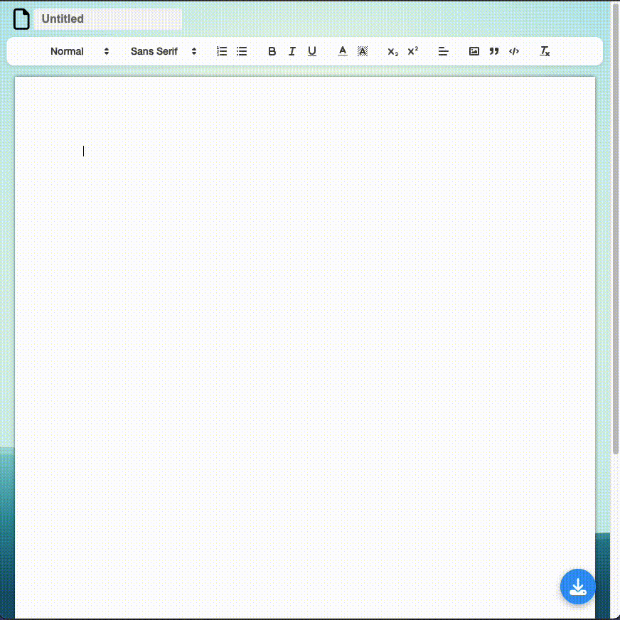

# Web Word Processor

The Web Word Processor is a web-based real-time word processor. This project was built using React, MongoDB, Quill, Express.js, and Socket.IO. It allows users to independently work on their tasks in real-time via Socket.IO, providing a unique UUID for each operation.

## Features

- **Independent Real-time Writing:** Each user connecting to the platform can work independently on their tasks. All changes are synced in real-time through Socket.IO, and a unique UUID is assigned for each operation.
- **Rich Text Editing:** Thanks to Quill, users can format their documents in various ways, including headings, bold, italic, underline, lists, and more.
- **Document Storage:** All documents are stored securely in MongoDB, ensuring they are safe and always available.
- **Instant Saving:** Changes are saved instantly as they're made, preventing any data loss.
- **File Download:** Users can download their documents in both PDF and Word formats.
- **Word Processing Features:** Provides basic Word functionalities for a familiar user experience.

## Technologies Used

- React
- MongoDB
- Quill
- Express.js
- Socket.IO

